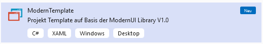
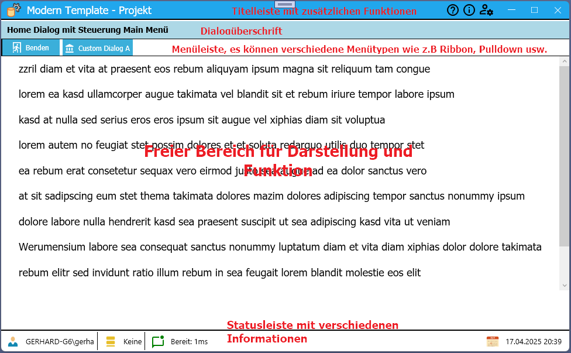

# Modern Projekt Template


]

# ModernTemplate
Das Template "ModernTemplate" kann über das Visual Studio als eine neuen Projekt ausgewählt werden.

## Neues Projekt erstellen


## Installation

Zur Installation und Verwendung der Projektvorlage **ModernTemplate.zip** muß diese zuvor in folgendes Verzeichnis kopiert werden.

```bat
c:\Users\<username>\Documents\Visual Studio 2022\Templates\ProjectTemplates\Visual C#\ModernUI\ModernTemplate.zip
```

## Features
Das Template erstell Anwendungen werden auf Basis eine *Single Page Architektur* entwickelt. Es gibt ein Hauptwindow, in dem alle weitere Dialoge als UserControl abgebildet geladen werden. Die Steuerung zwischen den UserControls (bzw. Dialoge als UserControl) erfolgt über eine Class-To-Class Kommunikation die im *InsindeVM Framework* als EventAggregator abgebildet ist.\
Nachteil dieser Lösung ist, komplexere Arten von Unit-Test können nicht so einfach umgesetzt werden.

### Hauptdialog



### Dialog-To-Dialog Kommunikation


### Commands 


### Get/Set


### Applikation Settings


### Logging


## ModernTemplate erstellen

# Release Notes


- ModernTemplate; Projekt Template zur Auswahl mit dem Visual Studio für die Neuerstellung eines Projektes.
