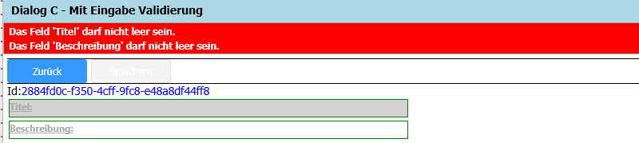
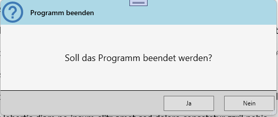

# Modern Projekt Template


]

# ModernTemplate
Das Template "ModernTemplate" kann über das Visual Studio als eine neuen Projekt ausgewählt werden.

# Inhalt
1. [Neues Projekt erstellen](#NewProject)
2. [Installation](#Installation)
3. [Features](#Features)</br>
    3.1. [Hauptdialog](#MainDialog)</br>
    3.2. [Dialog To Dialog Kommunikation](#dialogtodialogkommunikation)</br>
    3.3. [Commands](#Commands)</br>
    3.4. [Property Get/Set](#PropertyGetSet)</br>
    3.5. [Validierung von Eingaben](#FieldValidation)</br>
    3.6. [Applikation Settings](#ApplicationSettings)</br>
    3.7. [Logging](#ApplicationLogging)</br>
    3.8. [Message Dialoge](#NotificationService)</br>
    3.9. [Dialog Navigation](#DialogNavigation)

<div id='NewProject'/>

## Neues Projekt erstellen

Aus der Liste der Projektvorlagen wählen Sie die Vorlage *ModernTemplate* aus.


<div id='Installation'/>

## Installation der Templates

Zur Installation und Verwendung der Projektvorlage **ModernTemplate.zip** muß diese zuvor in folgendes Verzeichnis kopiert werden.

```bat
c:\Users\<username>\Documents\Visual Studio 2022\Templates\ProjectTemplates\Visual C#\ModernUI\ModernTemplate.zip
```

In der Regel wird der Template Cache automatisch aktualisiert. Sollte die Vorlage nicht gefunden bzw. ausgewählt werden können, kann es notwendig sein denn TemplateCache zu löschen.
```bat
REM ItemTemplate Cache
c:\Users\<username\AppData\Roaming\Microsoft\VisualStudio\17.0_a0c33062\ItemTemplatesCache\Visual C#\ModernUI\
```

zu dem Projekt Template gehörebn noch zwei weitere Template *DialogUserControl.zip* und *EmptyUserControl.zip*. Damit soll die Entwicklung von neuen Dialogen unterstützt werden.

<div id='Features'/>

## Features
Das Template erstell Anwendungen werden auf Basis eine *Single Page Architektur* entwickelt. Es gibt ein Hauptwindow, in dem alle weitere Dialoge als UserControl abgebildet geladen werden. Die Steuerung zwischen den UserControls (bzw. Dialoge als UserControl) erfolgt über eine Class-To-Class Kommunikation die im *InsindeVM Framework* als EventAggregator abgebildet ist.</br>
Es wird intern das bekannte **MVVM-Pattern** abgebildet, alledings in einer stark vereinfachte Weise und kommt daher ohne eine ViewModel-Klasse aus.
Trotzdem ist es nach wie vor möglich, eine externe ViewModel-Klasse zu verwenden. In den Basis-Klassen für Window als auch für UserControl sind alle Funktionalitäten für das **MVVM-Pattern** abgebildet. Das Binding zwischen XAML und der dazugehöringen *xaml.cs* funktioniert wie auch bei einer extrenen ViewModel-Klasse.</br>
Nachteil dieser Lösung ist, komplexere Arten von Unit-Test können nicht so einfach umgesetzt werden.

<div id='MainDialog'/>

### Hauptdialog


### Dialog To Dialog Kommunikation <a name="dialogtodialogkommunikation"></a>
Die Kommunikation zwischen den Dialogen (aber auch Klassen) erfolgt über einen Observer.

Senden von Werten
```csharp
base.EventAgg.Publish<ChangeViewEventArgs>(new ChangeViewEventArgs
{
    Sender = this.GetType().Name,
    MenuButton = CommandButtons.Home,
    FromPage = CommandButtons.Custom
});
```

Der *Publisher* sendet eine Information an alle *Subscriber*, die das Event-Argument *ChangeViewEventArgs* registriert haben.

Empfangen und ausführen
```csharp
base.EventAgg.Subscribe<ChangeViewEventArgs>(this.ChangeControl);
```

Der *Subscriber* empfängt die Werte, aller Instanzen, die für das Event-Argument *ChangeViewEventArgs* bestimmt sind. Der *Subscriber* führt automatisch die ihm zugewiesene Methode (im Beispiel **ChangeControl()**) mit den dazugehörigen Event-Arguments aus.

<div id='Commands'/>

### Commands 

Ein Klick auf einen Button löst über einen gebundenen *Command* ein Event im C# Source aus.
```xml
<ModernUI:PathButton
    Width="100"
    Height="30"
    Command="{Binding Path=CmdAgg[DialogBackCommand]}"
    IsDefault="True"
    PathData="{StaticResource ResourceKey=IconDialogBack}"
    PathWidth="14">
    <ModernUI:PathButton.ToolTip>
        <ModernUI:MToolTip Content="Zurück zum vorherigen Dialog" PlacementEx="TopLeft" />
    </ModernUI:PathButton.ToolTip>
    <ModernUI:PathButton.Content>
        <TextBlock>
            <Run Text="Zurück" />
        </TextBlock>
    </ModernUI:PathButton.Content>
</ModernUI:PathButton>
```

Im C# Source werden die benötigten Commands für den XAML-Code registriert und eine Methode zur Ausführung zugewiesen.
Hier gibt es nun die Möglichkeite per Enum; Hier wird der Textteil **Command** intern angehängt.</br>
Aus dem Enum *CommandButtons.DialogBack* wird intern *DialogBackCommand* wie es auch im XAML geschrieben ist.
```csharp
this.CmdAgg.AddOrSetCommand(CommandButtons.DialogBack, new RelayCommand(this.DialogBackHandler));
```

oder als String. Hier muß die Texterweiterung *Command* nicht extra hinzugefügt werden

```csharp
this.CmdAgg.AddOrSetCommand("DialogBackCommand", new RelayCommand(this.DialogBackHandler));
```

<div id='PropertyGetSet'/>

### Property Get/Set
Im Unterschied zu einem *Standard Get;Set;* werden bei dieser Variante keine *Private Field-Variabeln* benötigt. Die Bindungs-Funktion über das *INotifyPropertyChanged* ist bereits in der Basis-Klasse enthalten. Daher kann eine vereinfachte schreibweise verwendet werden.
```csharp
public string DemoText
{
    get => base.GetValue<string>();
    set => base.SetValue(value);
}
```
In der zweiten Variante kann auch eine Methode registriert werden, die z.B. bei der Eingabe ausgelößt wird.
```csharp
public string Titel
{
    get => base.GetValue<string>();
    set => base.SetValue(value, this.CheckContent);
}
```
Hier kann eine Behadlung oder Prüfung der Eingabe durchgeführt werden.
```csharp
private void CheckContent<T>(T value, string propertyName)
{
    PropertyInfo propInfo = this.GetType().GetProperties().FirstOrDefault(p => p.Name == propertyName);
    if (propInfo != null)
    {
        this.ChangedContent(true);
    }

    this.ValidationErrors.Clear();
    foreach (string property in this.GetProperties(this))
    {
        Func<Result<string>> function = null;
        if (this.ValidationRules.TryGetValue(property, out function) == true)
        {
            Result<string> ruleText = this.DoValidation(function, property);
            if (string.IsNullOrEmpty(ruleText.Value) == false)
            {
                this.ValidationErrors.Add(property, ruleText.Value);
            }
        }
    }
}
```

<div id='FieldValidation'/>

### Validierung von Eingaben

Die Prüfung der Eingaben erfolgt über die Klasse *ValidationRule* im Namespace *Core*. Hier sind schon einige Prüfungen hinterlegt, die bei Bedarf erweitert werden können.

|Name  |Typ|Beschreibung |
|:----------------|:-|:----------|
|NotEmpty|String|Inhalt darf nicht leer sein|
|NotEmptyAndMinChar|String|Inhalt darf nicht leer sein, und mind. x Zeichen|
|InRange|Int|Der Inhalt muß zwischen x und y liegen|
|GreaterThanZero|Int/Double|Der Inhalt muß größer 0 sein|

```csharp
private void RegisterValidations()
{
    this.ValidationRules.Add(nameof(this.Titel), () =>
    {
        return ValidationRule<DialogC>.This(this).NotEmpty(x => x.Titel, "Titel");
    });

    this.ValidationRules.Add(nameof(this.Description), () =>
    {
        return ValidationRule<DialogC>.This(this).NotEmpty(x => x.Description, "Beschreibung");
    });
}
```



Die Fehlerhaften Elemente werden in einer ListBox dargestellt. Über die Auswahl in der ListBox kann auf das jeweilige Eingabeelement gesprungen werden.

<div id='ApplicationSettings'/>

### Applikation Settings
Die Einstellungen für eine Applikation werden in eine JSON Datei unter *ProgramData\\APPLICATION* gespeichert.
Der Dateiname wird als *APPLICATION.USERNAME.Setting* erstellt.</br>
Die Basisklasse *SmartSettingsBase* beinhaltet alle Funktionen zum Lesen, Schreiben und prüfen der Settings.

```csharp
public class ApplicationSettings : SmartSettingsBase
{
    /// <summary>
    /// Initializes a new instance of the <see cref="ApplicationSettings"/> class.
    /// </summary>
    public ApplicationSettings() : base(null,App.SHORTNAME) { }

    public string LastUser { get; set; }

    public DateTime LastAccess { get; set; }

    public bool ExitApplicationQuestion { get; set; }

    public bool SaveLastWindowsPosition { get; set; }

    public int SetLoggingLevel { get; set; }
}
```

**Beschreibung der Funktionen**

|Name  |Typ|Beschreibung |
|:----------------|:-|:----------|
|Save()|void|Speichern des aktuellen Inhalt in eine JSON Datei|
|Load()|bool|Laden der Einstellungen aus einer JSON Datei in die dafür vorgesehende Properties|
|Reset()|void|Alle Properties auf den festgelegten Default-Wert setzten|
|Delete()|void|Die Settingsdatei löschen|
|IsExitSettings()|bool|Prüft, ob die Settingsdatei vorhanden ist|
|Filename|string|Gibt den Namen der Settingsdatei zurück|
|Pathname|string|Gibt das Verzeichnis der Settingsdatei zurück|
|GetProperties|IReadOnlyList\<PropertyInfo>|Gibt Liste der Properties zurück|
|GetDefaults|IReadOnlyList\<PropertyInfo>|Gibt Liste der Default Properties zurück|

<div id='ApplicationLogging'/>

### Logging
Das Template ist Standardmäßig mit einer Logging-Funktion ausgestattet. In der Klasse *App.xaml.cs* wird das Logging initalisiert.
Die Logger-Klasse ist so gebaut, das immer erst in eine *Queue* geschrieben wird, mit dem Aufruf der Methode *Logger.Flush();* werden alle Einträge in eine Log-Datei geschrieben und die *Queue* wider geleert.

```csharp
protected override void OnStartup(StartupEventArgs e)
{
    /* Initalisierung Logging */
    InitializeLogger();
}
```

Die Logdatei wird unter *\ProgramData\\\<APPLICATION>\Log\\\<LOGFILE-NAME>.log* gespeichert.

```csharp
private void InitializeLogger()
{
    LogFileOutHandler handler = new LogFileOutHandler(Path.Combine(ProgramDataPath,"Log"));
    Logger.AddHandler(handler);

    Logger.SetLevel(App.SetLoggingLevel);

    Logger.Info($"Start '{SHORTNAME}'");
    Logger.Info("InitializeLogger");
    Logger.Flush();
}
```

Die tatsächliche Steuerung des Output (z.B. in ein File, Console oder auch in eine Datebank) wird über die Klasse *LogFileOutHandler* gesteuert. Diese leitet von der Klasse *AbstractOutHandler* ab.
In der Klasse *LogFileOutHandler* kann zum einen festgelegt werden, wie eine Archvierung der Log-Dateien erfolgen soll, als auch der Aufbau der Logdatei (Log-Header und Log-Content)

<div id='NotificationService'/>

### Message Dialoge

Meldungsdialoge werden über einen *NotificationService* zur Verfügung gestellt. Im Grunde besteht ein Meldungsdialog aus drei Teilen:
 - Der Basis Funktion *NotificationService*
 - Dem *NotificationContent*, das ist der Meldungsdialog (MessageOk.xaml, QuestionYesNo.xaml) der dargestellt werden soll
 - Einer Klasse *MessageContent.cs* in dem die darzustellende Meldung beschrieben ist.

 Bevor eine Meldung verwendet werden kann, muß diese Registriert werden.

 Initalisierung des *NotificationService*
 ```csharp
private INotificationService notificationService = new NotificationService();
```

 Registrieren der zu verwendeten Meldungen
 ```csharp
 private void OnLoaded(object sender, RoutedEventArgs e)
 {
    NotificationService.RegisterDialog<QuestionYesNo>();
    NotificationService.RegisterDialog<MessageOk>();
}
```

Beispiel zur Meldung *ApplicationExit()*
```csharp
public static NotificationBoxButton ApplicationExit(this INotificationService @this)
{
    (string InfoText, string CustomText, double FontSize) msgText = ("Programm beenden", $"Soll das Programm beendet werden?", 18);
    NotificationBoxButton questionResult = NotificationBoxButton.No;

    @this.ShowDialog<QuestionYesNo>(msgText, (result, tag) =>
    {
        if (result == true && tag != null)
        {
            questionResult = ((Tuple<NotificationBoxButton>)tag).Item1;
        }
    });

    return questionResult;
}
```

Die eigentliche Meldung wird als Extension des Typ *INotificationService* erstellt und auch so aufgerufen.

Verwenden einer Meldung
```csharp
NotificationBoxButton result = this.notificationService.ApplicationExit();
if (result == NotificationBoxButton.Yes)
{
    this.ExitApplication(e);
}
```

Diese Vorgehensweise ermöglich eine sehr flexible Darstellung und Verwendung der Notification-Dialoge. So können z.B. Meldungsdialoge mit einem HTML Content erstellt werden, aber auch Dialoge mit einer Eingabe bzw. Auswahl (ListBox, ComboBox) sind ebenfalls möglich.



<div id='DialogNavigation'/>

### Dialog Navigation

Über die Klasse *DialogFactory.cs* werden die zur Applikation gehörenden Dialoge verwaltet bzw. über die Enum-Klasse *CommandButtons.cs* ausgewählt und zurückgegeben.

- CommandButtons.cs
  Hier werden alle Einträge festgelegt, denen ein Dialog zugeordnet werden soll
  ```csharp
    public enum CommandButtons : int
    {
        [Description("Keine Auswahl")]
        None = 0,
        [Description("Home Dialog mit Steuerung Main Menü")]
        Home = 1,
    }
  ```
  Das *Description* Attribute wird zur Beschreibung des Dialogtitel verwendet.

- DialogFactory.cs
  Die Klasse *DialogFactory* hat zum einen die Aufgabe der Registrierung der zu verwendeten Dialoge, zum anderen gibt die Klasse als *Factory* den gewählten Dialog als *UserControl* zurück.
  ```csharp
    private static void RegisterControls()
    {
        try
        {
            if (Views == null)
            {
                Views = new Dictionary<Enum, Type>();
                Views.Add(CommandButtons.Home, typeof(HomeUC));
            }
        }
        catch (Exception ex)
        {
            string errorText = ex.Message;
            throw;
        }
    }
  ```
  Zurückgeben eines gewählten Dialog mit der Methode *Get()*
  ```csharp
    public static FactoryResult Get(CommandButtons mainButton, IChangeViewEventArgs changeViewArgs)
    {
        FactoryResult resultContent = null;
        using (LoadingWaitCursor wc = new LoadingWaitCursor())
        {
            using (LoadingViewTime lvt = new LoadingViewTime())
            {
                GC.Collect();
                GC.WaitForPendingFinalizers();

                if (Views.ContainsKey(mainButton) == true)
                {
                    UserControlBase resultInstance = CreateInstanceContent(mainButton, changeViewArgs);
                    resultContent = new FactoryResult(resultInstance);
                    resultContent.WorkContent.Focusable = true;
                    resultContent.WorkContent.Focus();
                    resultContent.UsedTime = lvt.Result();
                    resultContent.ButtonDescription = mainButton.ToDescription();
                }
            }
        }

        return resultContent;
    }
  ```


# Release Notes


- ModernTemplate; Projekt Template zur Auswahl mit dem Visual Studio für die Neuerstellung eines Projektes.
