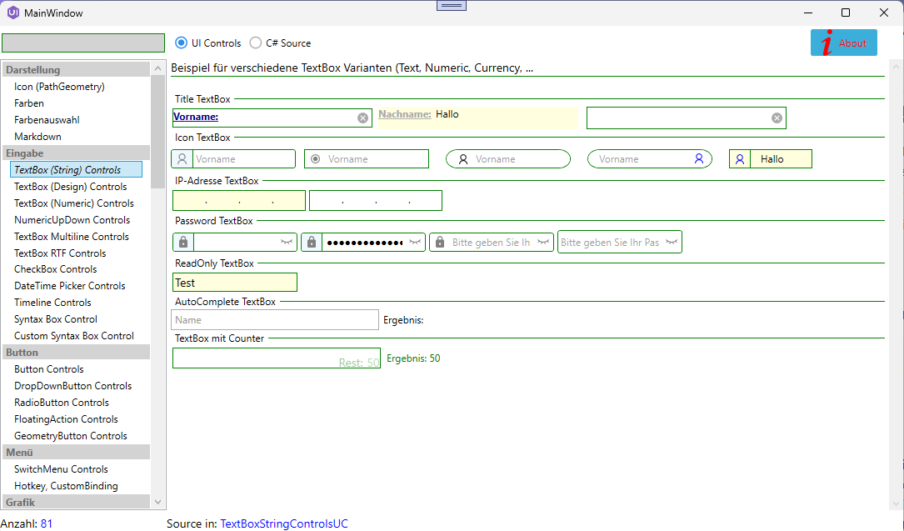
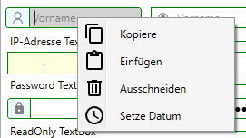
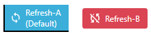
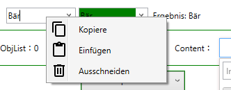
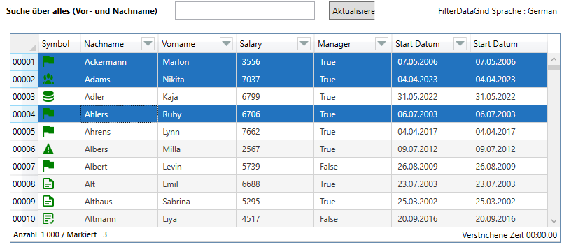
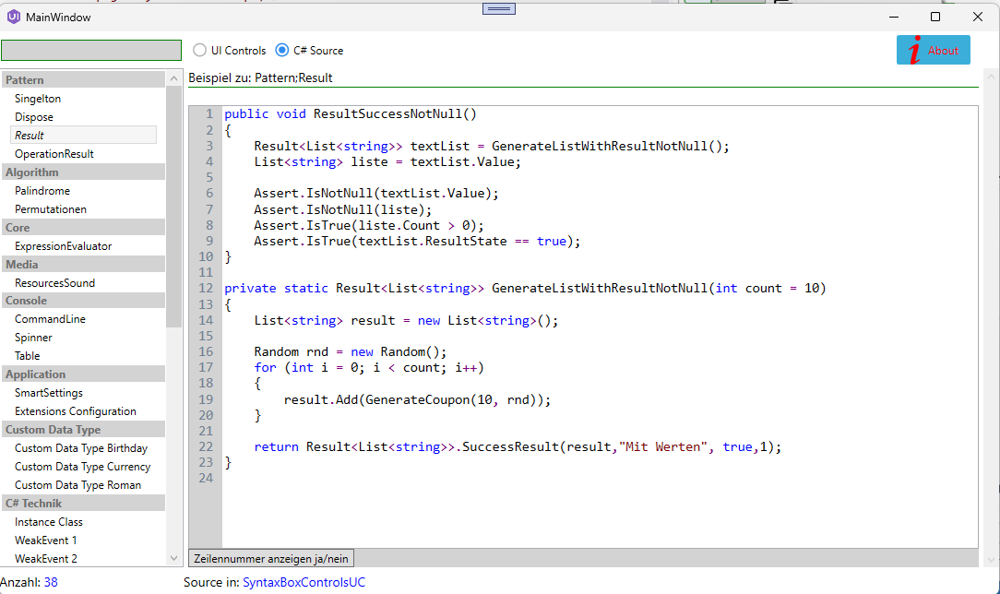
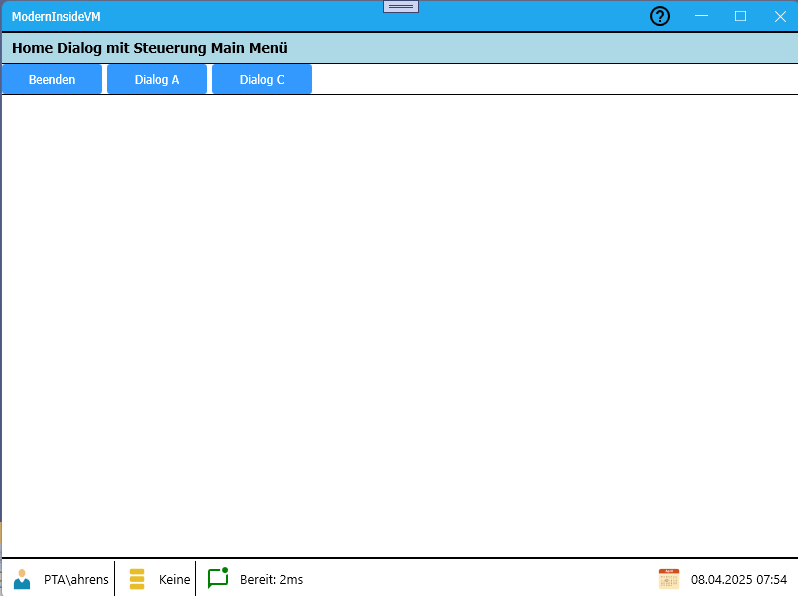
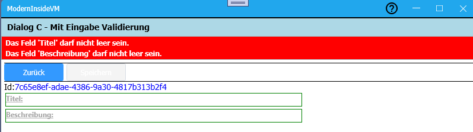

# Modern Library für C# Funktionen und UI Controls


]

Die beiden Bibliotheken **ModernUI** und **Modern Base Library** sind eine Zusammenfassung von Arbeiten aus den letzten 15 Jahre in C# und WPF. So sind eine vielzahl von UserControls und C# Klassen entstanden, die für eine Wiederverwertung aufbereitet wurden.

Die Funktionalität in zwei Bibliotheken
- ModernUI
- ModernBaseLibrary

aufgeteilt. Zusätzlich gibt es noch
- **Modern IU Demo**<br> 
  Hier werden die meisten vorhanden UI Elemente in verschiedenen Kategorien dargestellt
- **Modern Test**</br>
  Für viele Klassen und Funktionen sind Tests erstellt um die Funktionsweis zu dokumentieren.
- **ModernInsideVM**</br>
  Beispielprogramnm zu einer MVVM Variant</br>
- **ModernTemplate**</br>
  Projekt zur Erstellung eines Template für das **ModernInsideVM** Framework. Das Projekt- und Itemtemplate kann denn für eine neues Projekt undw eitere Dialoge als Window oder UserControl verwendet werden.

Desweiteren wird über die beiden Bibliotheken ein Entwicklungsframework zur einfachen Erstellung von Applikationen mit WPF und dem MVVM Pattern zur Verfügung gestellt.
Hier wird aber nicht der klassische Ansatz des MVVM Pattern verfolgt, sondern ein Ansatz den ich **Inside MVVM** nenne.
Mit diesem Ansatz wird auf eine eigene View-Model-Klasse verzichtet. Eine **Window** oder **UserControl** hat hier bereits eine eigene Basisklasse, inder alle notwendigen Funktionalitäten für Binding, Command als ein EventAggregator beinhalten. Das Beispiel dazu ist in dem Projekt **ModernMVVMDemo** dargestellt.

# Hinweis
Die Bibliothek ist für private Zwecke entstanden, daher nicht sichergestellt, das alle UI Controls und Klassen auch einwandfrei funktionieren.
Diese Bibliothek ist daher eher eine Sammlung von meinen Arbeiten aus den letzten 10-15 Jahren. Dazu habe ich alte Sourcen durchforstet, soweit notwendig an NET Core 8 und auch an gewisse Standards angepasst. Da zu allem auch die Sourcen vorhanden sind, kann jeder notwendige Korrekturen selbst durchführen.

# Modern UI Demo

In dem Demoprogramm werden eine Vielzahl von UI Controls vorgestellt sowie Source zu verschiedenen Themenbereiche als *Code-Snippets* angezeigt.

# Modern UI Controls for NET

Die Bibliothek beinhaltet eine Vielzahl von WPF NET UI controls für z.B.. TextBox in verschiedenen Varianten, Button, CheckBox, RadioButton, ComboBox, einfache Charts usw.



Ein große Anzahl von Controls sind auf einem einheitlichen *Look and Feel* im Bezug auf Darstellung, Contextmenü aufgebaut.
In vielen Controls, wenn diese mit einem Bild oder Grafik ausgestattet ist, kommen Vektor Grafiken in Form von XAML Icon (PathGeometry) zum Einsatz.<br>
Hier ein paar Beispiele:

## TextBox mit ContextMenu


## Flat Button mit Grafik und Default-Markierung (linker Button)


## ComboBox mit ContextMenu


## DataGrid mit Erweiteren Funktionen



# Modern Base Library for NET

Klassen für vielfältigen Funktionen


# Modern *InsideVM*

Unter dem Begriff **InsideVM** wird eine Framework zur Entwicklung von MVVM basierte WPF Desktop Anwendungen zur Verfügung gestellt.
- Basis-Klassen
- Property Bindung
- Command Binding (über eine Command Aggregator)
- Abbildung einer Class-To-Class Kommunikation (über einen Event Aggregator)
- Validierung von Eingaben

Dieser Ansatz spart zum einen die ViewModel-Klasse, ermöglicht aber den direkten Zugriff auf alle Controls, um aufwendige technische Funktionen zu ermöglichen. Zeitaufwendige Programmierung zur umsetzten können auf diese Art reduziert werden.</br>
Mit dem Ansatz von *InsideVM* wird versucht die möglichkeiten von *Code Behind* und einem *klassischen ViewModel* auf einfache Weise zusammen zu bringen.\
Die Vorteile dieser Lösungen zeigt sich bei der Entwicklung von [Monotithischen](https://www.computerweekly.com/de/definition/Monolithische-Architektur) bzw. [Modulitischen](https://entwickler.de/software-architektur/aus-monolith-wird-modulith) Anwendungen bei denen der Focus auf eine schnelle und einfache Entwicklung steht.</br>

Anwendungen werden auf Basis eine *Single Page Architektur* entwickelt. Es gibt ein Hauptwindow, in dem alle weitere Dialoge als UserControl abgebildet geladen werden. Die Steuerung zwischen den UserControls erfolgt über eine Class-To-Class Kommunikation die im *InsindeVM Framework* als EventAggregator abgebildet ist.\
Nachteil dieser Lösung ist, komplexere Arten von Unit-Test können nicht so einfach umgesetzt werden.

**Beispiel Hauptmenü**


## Basisklassen
*Window* und *UserControl* leiten jeweils von einer Basis Klasse ab, die weitere Funktionalitäten wie:
- Property Binding
- Validierung
- ViewState
- usw.
zur Verfügung stellt.
```csharp
public partial class MainWindow : WindowBase, IDialogClosing
{
}
/* oder */
public partial class DialogC : UserControlBase
{
}
```

## Property Bindung
Diese Schreibweise für ein Get/Set Property spart zum einen die Membervariable zum anderen ist es auch möglich eine After-Action-Methode anzugeben.
```csharp
public string DialogDescription
{
    get => base.GetValue<string>();
    set => base.SetValue(value);
}
/* oder */
public string Description
{
    get => base.GetValue<string>();
    set => base.SetValue(value,this.CheckContent);
}
```

## Command Binding

## Class-To-Class Kommunikation

## Validierung
Die Validierung von Eingabe erfolgt über eine einfache Fluent API

```csharp
private void RegisterValidations()
{
    this.ValidationRules.Add(nameof(this.Titel), () =>
    {
        return InputValidation<DialogC>.This(this).NotEmpty(x => x.Titel, "Titel");
    });

    this.ValidationRules.Add(nameof(this.Description), () =>
    {
        return InputValidation<DialogC>.This(this).NotEmpty(x => x.Description, "Beschreibung");
    });
}
```


In der ListeBox (oben) werden evenuelle Fehler dargestellt. Es kann ein Eintrag ausugewählt werden, auf diesen dann positioniert wird und zur besseren Darstellung dann auch die Hintergrundfarbe geändert wird.


# ModernTemplate
Das Template "ModernTemplate" kann über das Visual Studio als eine neuen Projekt ausgewählt werden.

## Installation

Zur Installation und Verwendung der Projektvorlage **ModernTemplate.zip** muß diese zuvor in folgendes Verzeichnis kopiert werden.

```bat
c:\Users\<username>\Documents\Visual Studio 2022\Templates\ProjectTemplates\Visual C#\ModernUI\ModernTemplate.zip
```
</br>

## Features

Das Template erstell Anwendungen werden auf Basis eine *Single Page Architektur* entwickelt. Es gibt ein Hauptwindow, in dem alle weitere Dialoge als UserControl abgebildet geladen werden. Die Steuerung zwischen den UserControls (bzw. Dialoge als UserControl) erfolgt über eine Class-To-Class Kommunikation die im *InsindeVM Framework* als EventAggregator abgebildet ist.\
Nachteil dieser Lösung ist, komplexere Arten von Unit-Test können nicht so einfach umgesetzt werden.

# Modern Console

**Modern Console** ist eine Sammlung von Klassen die im besonderen für Consolen-Anwendungen eingesetzt werden können.

# Release Notes
<br>
- Aufbau der Bibliothek mit UI Controls
- Demo Programm um die Verwendung der UI Controls darzustellen


- Aufbau der Modern Base Library
- Erweiterung des Demoprogramm um C# Source in einem eigenen einfachen Editor darzustellen


- Demo-Applikation zum InsideVM Framework
- Weitere Korrekturen in der Base- und UI Library


- ModernTemplate; Projekt Template zur Auswahl mit dem Visual Studio für die Neuerstellung eines Projektes.
